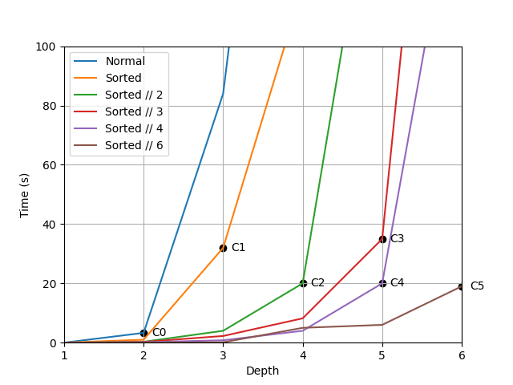
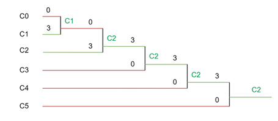

# Abalone Competitive Agent

This is an implementation of a competitive agent for the Abalone game.

## What is Abalone?

Abalone is a two-player abstract strategy board game where the objective is to push six of the opponent's marbles off the edge of the board. Players take turns moving one, two, or three of their marbles in a straight line or laterally.

  

## Code

You can find my optimized Minimax algorithm with Alpha-Beta Pruning implementation in the following file:
[Link to my_MiniMax.py](Abalone/my_MiniMax.py)

This is the only relevant file for this code sample.

## Project Overview

In a tournament featuring 39 competitive agents, my algorithm secured first place. This was a collaborative project where my teammate implemented a Monte Carlo Tree Search (MCTS) algorithm, while I developed the MiniMax algorithm. After testing both approaches, we determined that MiniMax outperformed MCTS and used it for the competition. The algorithm was designed to handle strict time constraints, as each game was limited to 900 seconds.

For this code sample, I’ve removed the MCTS implementation and included only the MiniMax algorithm, which I authored for the contest.

You can visualize the tournament results (brackets) by visiting the following link: [Tournament Results](https://challonge.com/fr/ykol0oke). My team name was "mayoman".

## Minimax Heuristics

The minimax algorithm, while effective, suffers from the limitation of traversing the entire game tree to the end, which is excessively time-consuming and resource-intensive. So, to evaluate the state of a game and determine whether a player is winning, four heuristics have been developed. Of these, heuristics H1, H2 and H3 have been retained and combined as the final heuristic.

### Center of gravity (H1) [[1](https://courses.cs.washington.edu/courses/cse573/04au/Project/mini1/JET/report_abalone.pdf)]

While playing Abalone, I noticed the strategic advantage of controlling the center squares for several reasons. Firstly, marbles positioned in the center of the board are protected from loss. Secondly, by dominating the center, it's easier to push the opponent towards the edges of the board. Thirdly, in the event of a tie, the player with the most centered marbles wins the game. This strategy is implemented via a Manhattan distance calculation, where the difference between the sum of the distances of the opponent's marbles and those of the player's own marbles determines the dominant position. This calculation is made in relation to the central square of the board. This approach encourages the agent to avoid the edges and conquer the center by pushing the opponent back. Although this strategy is rather defensive, it can be effectively combined with more aggressive approaches to form a balanced strategic compromise.

### Attack (H2) [[1](https://courses.cs.washington.edu/courses/cse573/04au/Project/mini1/JET/report_abalone.pdf)]
This heuristic, complementary to the previous one, is rather simple. It boils down to subtracting one's score from that of the opponent in a given state. This more aggressive approach encourages the agent to maximize its score while decreasing that of its opponent.

### Sumito Potential (H3)

This third heuristic aims to assess Sumito's potential (ejection or risk of ejection from the board) at a given moment. It simply involves scanning the board to determine which player has the most balls at the ends of the game. To do this, I recorded all the squares at the ends of the board in a static data structure. If an opponent's marble is present on one of these squares, we add 2 to the score. On the other hand, if one of our marbles occupies one of these squares, we subtract 1 from the score (in order to avoid a complete cancellation of the score, as 2 - 2 would give 0, in which case our agent would have less incentive to push his opponent towards the edges of the board). This relatively aggressive approach encourages the agent to push his opponent towards the edges of the board, thus increasing Sumito's potential.

## Minimax Optimization

I soon noticed that a basic implementation of the minimax algorithm was not sufficient to search the depth of the game tree, as this required a considerable amount of time for a depth of 2. Consequently, I introduced 𝞪 𝞫 pruning to avoid exploring all the branches of our tree. However, even with this optimization, performing a search to a depth of 3 took an average of 84 seconds, which was unacceptable for the competition.

I optimized pruning by sorting possible actions before visiting them. In the max_value() function, I opted for a descending sorting of our actions according to our heuristics before exploring them. In the min_value() function, I opted for an ascending sorting of our actions before exploring them. This slight adjustment enabled our algorithm to perform more efficient branch pruning in the search tree, allowing us to reach a depth of 3 with an average search time of 35 seconds. This represents a difference of 49 seconds compared with the algorithm without sorting for the same depth.

#### Graph 1: Depth search time depending on sorted actions

  

In the above graph, I tested different configurations of the minimax algorithm and pruning 𝞪-𝞫 to evaluate the time required to reach different depths:
- **Normal**: algorithm without action sorting
- **Sorted**: algorithm with action sorting
- **Sorted // 2**: only the first half of the sorted actions is explored
- **Sorted // 3**: only the first third of sorted actions is explored
- **Sorted // 4**: only the first quarter of sorted actions is explored
- **Sorted // 6**: only the first sixth of sorted actions is explored

As shown in Graph 1, action sorting and action selection enable a more in-depth search. For a configuration to be considered viable, the search time must be less than 40 seconds, as we only have 900 seconds to make 25 moves during the tournament. The following configurations were therefore selected to compare their performance (see Graph 1):

- **C0**: Normal → Depth 2
- **C1**: Sorted → Depth 3
- **C2**: Sorted // 2 → Depth 4
- **C3**: Sorted // 3 → Depth 5
- **C4**: Sorted // 4 → Depth 5
- **C5**: Sorted // 6 → Depth 6

To determine the best configuration among these, I organized a tournament (see Graph 2) between them to see which would perform best. Each configuration played 3 matches against each other.

#### Graph 2: Configuration tournament results

  

As shown in Graph 2, the C2 configuration dominates all the others. This means that a minimax with pruning, where only the first half of the sorted actions are explored, gives the best results in the contest. So there's a trade-off between search width and search depth. For example, by exploring only the first sixth of the sorted actions, it is possible to anticipate up to 6 moves. However, sometimes it's beneficial to explore more moves, even at the expense of the quality of the immediate solution, in order to reach a more favorable final state. That's why our configuration, which explores half the moves, performs better, even if it doesn't go as deep into the search as C5.
